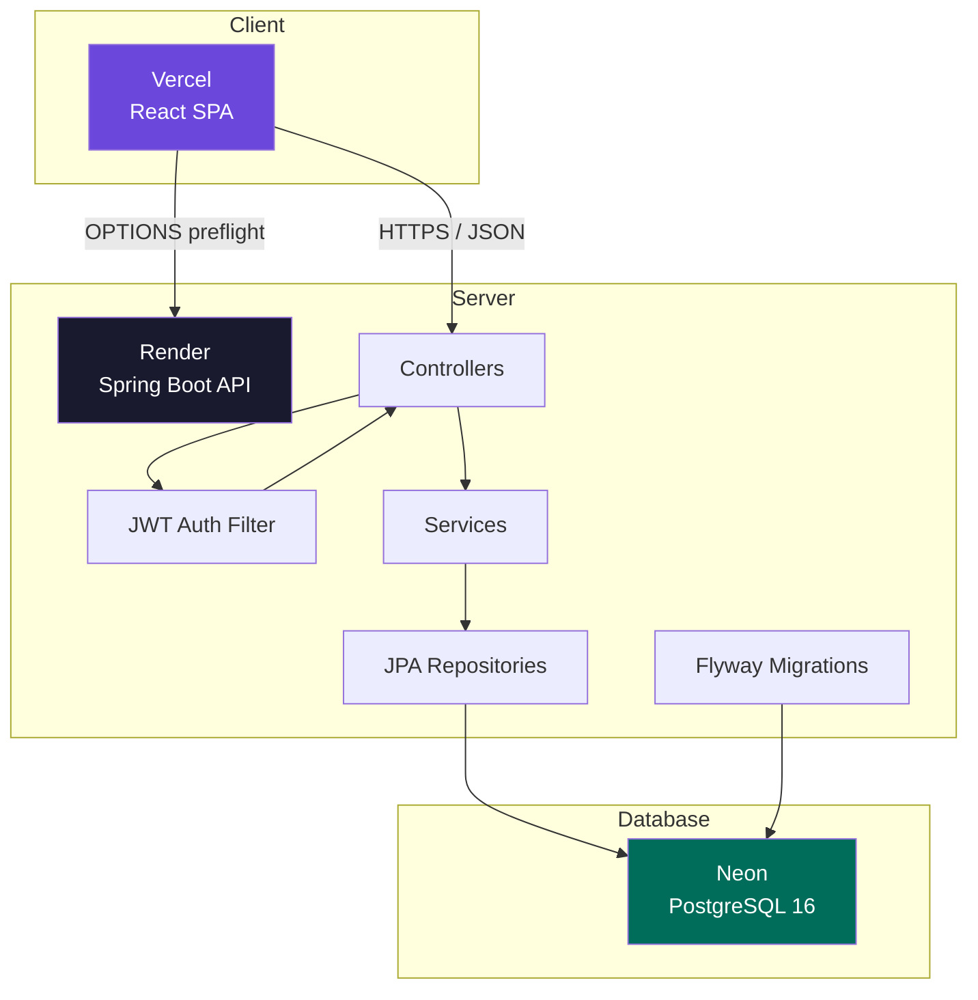
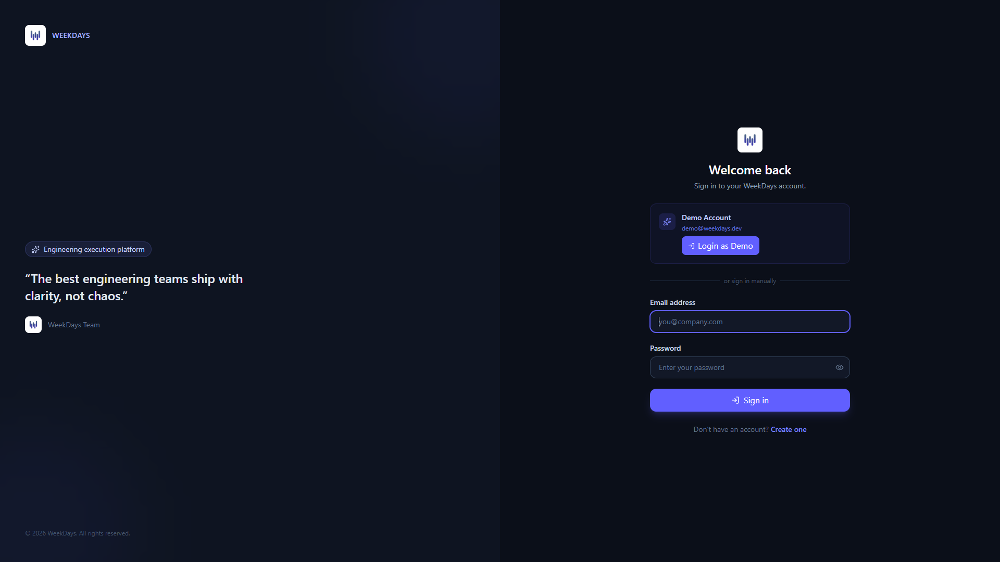
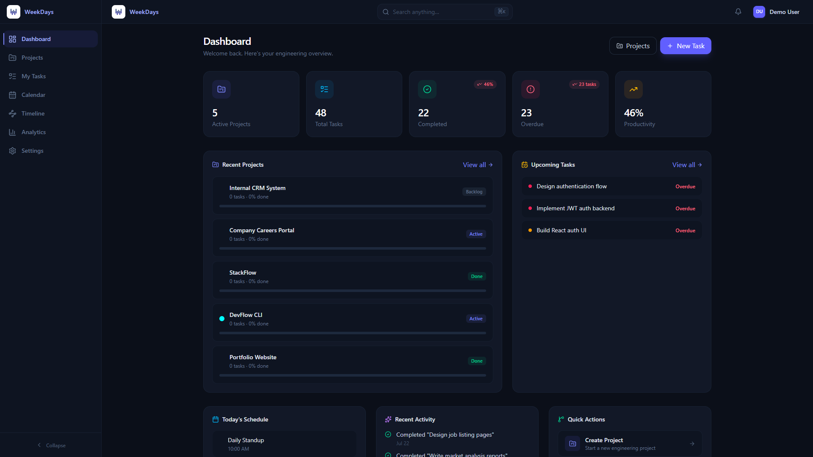
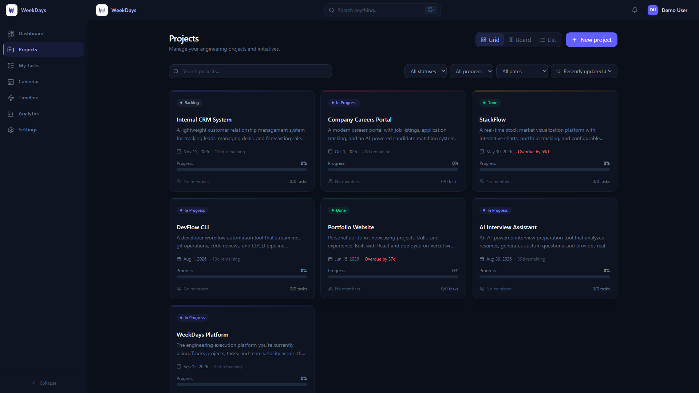
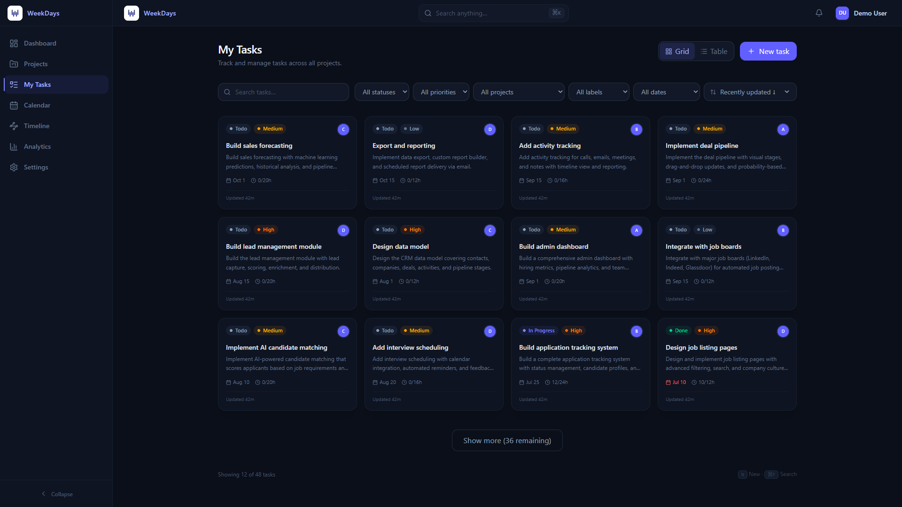
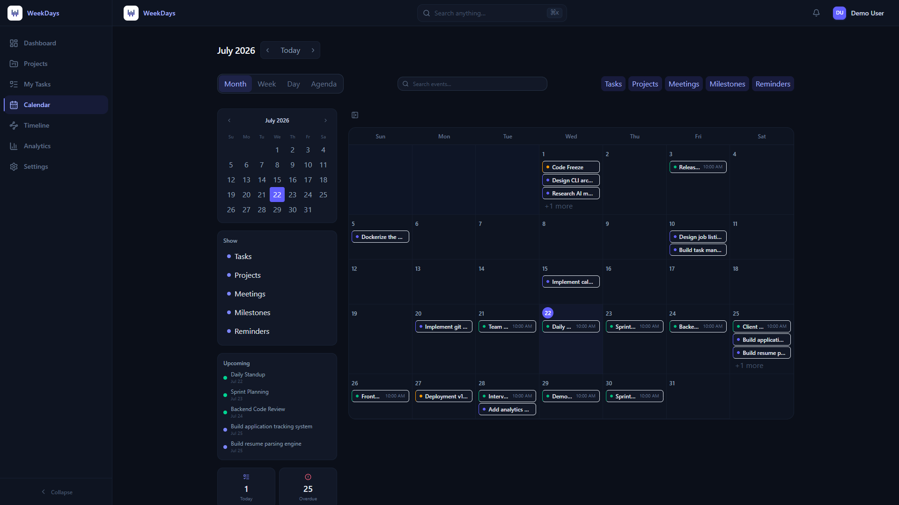
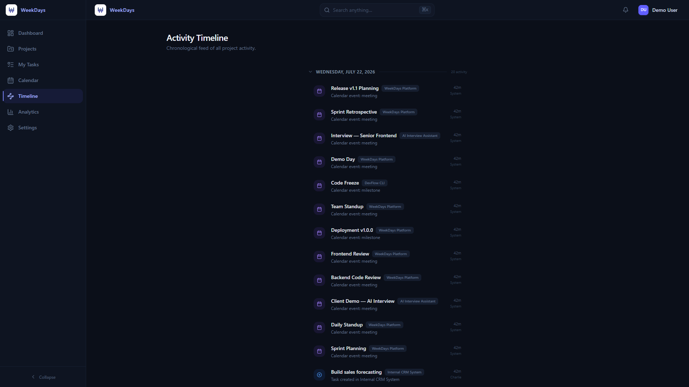
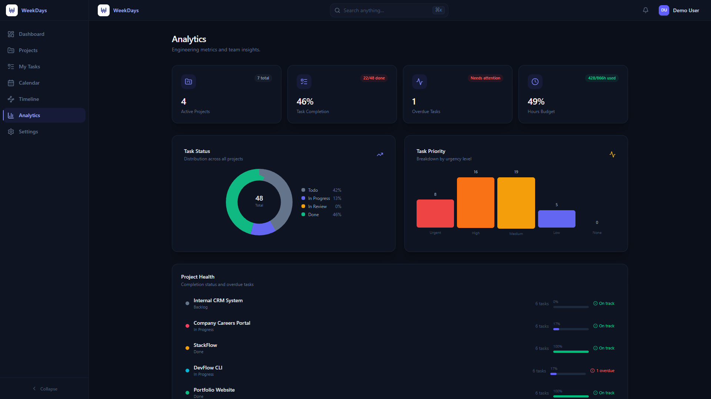
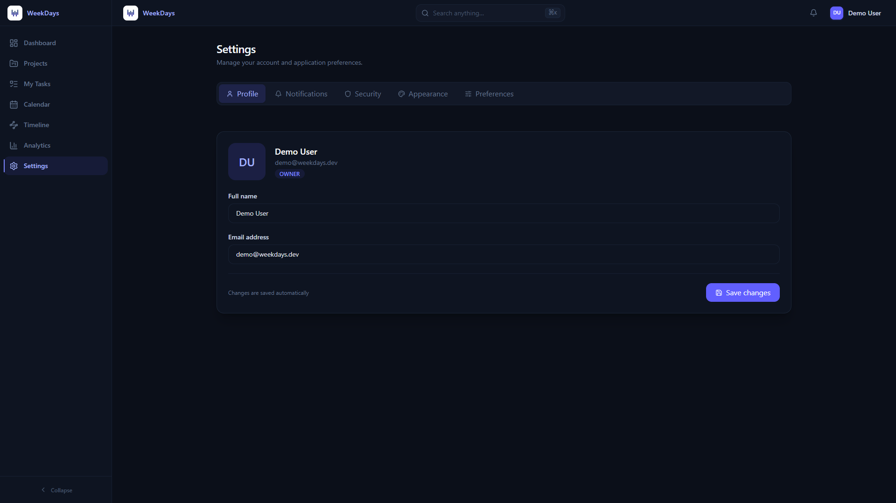
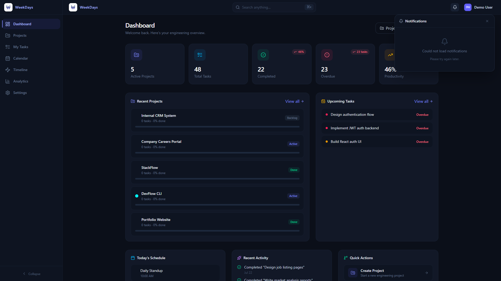

<div align="center">

# WeekDays

**A production-grade engineering execution platform for planning projects, coordinating teams, and delivering software.**

[](https://www.oracle.com/java/)
[](https://spring.io/projects/spring-boot)
[](https://react.dev/)
[](https://www.typescriptlang.org/)
[](https://www.postgresql.org/)
[](https://vitejs.dev/)
[](https://www.docker.com/)
[](LICENSE)

<a href="https://weekdays-gules.vercel.app">**View Live Demo →**</a>

</div>

---

## 🚀 Live Demo

| Application | URL |
|-------------|-----|
| **Frontend** | [https://weekdays-gules.vercel.app](https://weekdays-gules.vercel.app) |
| **Backend API** | [https://weekdays-nznb.onrender.com](https://weekdays-nznb.onrender.com) |
| **Health Check** | [https://weekdays-nznb.onrender.com/actuator/health](https://weekdays-nznb.onrender.com/actuator/health) |

> **Try the demo:** Open the frontend and click **"Login as Demo"** — no registration needed.

---

## 📖 Overview

WeekDays is a full-stack project management application built to demonstrate production-grade software engineering practices. It combines a modern React SPA with a Spring Boot REST API, secured by JWT authentication and backed by PostgreSQL.

The platform supports project and task management with Kanban boards, calendar views, analytics dashboards, activity timelines, and a real-time notification system — all wrapped in a dark-first, responsive UI.

This project was designed to showcase real-world architecture decisions: clean layered architecture, database migrations with Flyway, secure token-based authentication, production Docker builds, and deployment across Vercel, Render, and Neon.

---

## ✨ Features

### 🔐 Authentication
- JWT-based access tokens with refresh token rotation
- Secure password hashing (BCrypt)
- Demo login for instant exploration
- Persistent sessions across browser restarts

### 📋 Project Management
- Create, edit, delete, and archive projects
- Kanban board, grid, and list views
- Drag-and-drop status updates
- Status, progress, priority, and due date tracking

### ✅ Task Management
- Full CRUD with archive and restore
- Grid, table, and Kanban views
- Multi-select bulk operations (status, priority, archive, delete)
- Filtering by status, priority, assignee, project, due date, and labels
- Sorting, search, checklists, and comments

### 📅 Calendar
- Month, week, day, and agenda views
- Drag-and-drop event rescheduling
- Mini calendar navigation
- Quick filters for tasks, projects, meetings, and milestones

### 📊 Analytics Dashboard
- Real-time project and task metrics
- Status and priority distribution charts
- Project health monitoring
- Team workload analysis
- Recent activity feed

### ⏱ Timeline
- Chronological activity feed
- Auto-generated from projects, tasks, and calendar events
- Paginated with "load more"
- Grouped by date

### 🔔 Notifications
- Real-time notification panel
- Read/unread state tracking
- Contextual links to related resources

---

## 🛠 Tech Stack

### Frontend
| Technology | Purpose |
|------------|---------|
| **React 19** | UI framework |
| **TypeScript** | Type safety |
| **Vite** | Build tool and dev server |
| **Tailwind CSS** | Utility-first styling |
| **Zustand** | State management (auth) |
| **React Query** | Server state and caching |
| **React Router** | Client-side routing |
| **React Hook Form** | Form validation |
| **Axios** | HTTP client |
| **Lucide React** | Icons |

### Backend
| Technology | Purpose |
|------------|---------|
| **Spring Boot 3.5** | REST API framework |
| **Java 21** | Runtime |
| **Spring Security** | Authentication and authorization |
| **Spring Data JPA** | Database access |
| **Flyway** | Database migrations |
| **JWT (jjwt)** | Token-based auth |
| **BCrypt** | Password hashing |
| **HikariCP** | Connection pooling |

### Infrastructure
| Service | Purpose |
|---------|---------|
| **PostgreSQL 16** (Neon) | Primary database |
| **Docker / Compose** | Local development |
| **Nginx** | Frontend reverse proxy |
| **Vercel** | Frontend hosting |
| **Render** | Backend hosting |

---

## 🏗 Architecture



**Flow:** The React frontend on Vercel communicates with the Spring Boot API on Render over HTTPS. All authenticated requests pass through a JWT authentication filter. The API follows a layered architecture: Controllers → Services → JPA Repositories → PostgreSQL. Database schema is managed via Flyway migrations.

---

## 📸 Screenshots

| Login | Dashboard | Projects |
|:---:|:---:|:---:|
|  |  |  |

| Tasks | Calendar | Timeline |
|:---:|:---:|:---:|
|  |  |  |

| Analytics | Settings | Notifications |
|:---:|:---:|:---:|
|  |  |  |

---

## 🚦 Getting Started

### Prerequisites

- **Java 21** — [Download](https://adoptium.net/)
- **Node.js 22+** — [Download](https://nodejs.org/)
- **Docker 24+** (optional, for containerized setup)
- **PostgreSQL 16** (optional, Docker provides this)

### Quick Start (Docker)

```bash
# Clone the repository
git clone https://github.com/karthikJKST/weekdays.git
cd weekdays

# Build and start all services
docker compose up --build

# Open in your browser
open http://localhost
```

### Local Development (without Docker)

**1. Start PostgreSQL**
```bash
docker compose up -d postgres
```

**2. Start the backend** (from `backend/`)
```bash
# Backend runs on http://localhost:8080
cd backend
mvn spring-boot:run
```

**3. Start the frontend** (from `frontend/`, in a new terminal)
```bash
cd frontend
npm install
npm run dev
# Opens at http://localhost:5173
```

### Docker Commands

| Command | Description |
|---------|-------------|
| `docker compose up --build` | Build and start all services |
| `docker compose up -d --build` | Start in detached mode |
| `docker compose down` | Stop all services |
| `docker compose down -v` | Stop and delete database data |
| `docker compose logs -f` | Follow all logs |

---

## 🔧 Environment Variables

### Frontend (`frontend/`)

| Variable | Default | Required | Description |
|----------|---------|----------|-------------|
| `VITE_API_BASE_URL` | `http://localhost:8080/api/v1` | Yes | Backend API URL |

### Backend (`backend/`)

| Variable | Default | Required | Description |
|----------|---------|----------|-------------|
| `DATABASE_URL` | `jdbc:postgresql://localhost:5432/weekdays` | Yes | PostgreSQL JDBC URL |
| `DATABASE_USERNAME` | `postgres` | Yes | Database user |
| `DATABASE_PASSWORD` | `postgres` | Yes | Database password |
| `JWT_SECRET` | Dev-only default | Yes | JWT signing key (`openssl rand -base64 64`) |
| `JWT_ACCESS_TOKEN_MINUTES` | `15` | No | Access token TTL |
| `JWT_REFRESH_TOKEN_DAYS` | `14` | No | Refresh token TTL |
| `CORS_ALLOWED_ORIGIN` | `http://localhost:5173` | Yes | Frontend URL for CORS |
| `PORT` | `8080` | No | Server port |
| `SPRING_PROFILES_ACTIVE` | — | Yes | Set to `production` for deployment |

---

## 📡 API Overview

| Method | Endpoint | Auth | Description |
|--------|----------|------|-------------|
| `POST` | `/api/v1/auth/register` | — | Register new user |
| `POST` | `/api/v1/auth/login` | — | Login |
| `POST` | `/api/v1/auth/refresh` | — | Refresh access token |
| `GET` | `/api/v1/auth/me` | ✓ | Current user profile |
| `GET` | `/api/v1/health` | — | Health check |
| | | | |
| `GET` | `/api/v1/projects` | ✓ | List projects |
| `POST` | `/api/v1/projects` | ✓ | Create project |
| `PUT` | `/api/v1/projects/{id}` | ✓ | Update project |
| `DELETE` | `/api/v1/projects/{id}` | ✓ | Delete project |
| | | | |
| `GET` | `/api/v1/tasks` | ✓ | List tasks |
| `POST` | `/api/v1/tasks` | ✓ | Create task |
| `PUT` | `/api/v1/tasks/{id}` | ✓ | Update task |
| `PATCH` | `/api/v1/tasks/{id}/status` | ✓ | Update task status |
| `PATCH` | `/api/v1/tasks/{id}/priority` | ✓ | Update task priority |
| `DELETE` | `/api/v1/tasks/{id}` | ✓ | Delete task |
| | | | |
| `GET` | `/api/v1/calendar` | ✓ | List calendar events |
| `POST` | `/api/v1/calendar` | ✓ | Create event |
| `PUT` | `/api/v1/calendar/{id}` | ✓ | Update event |
| `DELETE` | `/api/v1/calendar/{id}` | ✓ | Delete event |
| | | | |
| `GET` | `/api/v1/analytics/dashboard` | ✓ | Analytics data |
| `GET` | `/api/v1/notifications` | ✓ | List notifications |
| `PATCH` | `/api/v1/notifications/{id}/read` | ✓ | Mark notification read |
| `GET` | `/api/v1/timeline` | ✓ | Activity timeline |

Full API documentation: [docs/api.md](docs/api.md)

---

## 📁 Project Structure

```
WeekDays/
├── backend/                          # Spring Boot REST API
│   ├── src/main/java/com/weekdays/api/
│   │   ├── analytics/                # Dashboard metrics
│   │   ├── auth/                     # JWT authentication
│   │   ├── calendar/                 # Calendar events
│   │   ├── config/                   # Security configuration
│   │   ├── notification/             # Push notifications
│   │   ├── project/                  # Project management
│   │   ├── task/                     # Task management
│   │   ├── timeline/                 # Activity timeline
│   │   ├── user/                     # User entity
│   │   ├── DataInitializer.java      # Dev data seeder
│   │   ├── ProductionDemoSeeder.java # Production demo account
│   │   ├── GlobalExceptionHandler.java
│   │   └── WeekDaysApplication.java
│   ├── src/main/resources/
│   │   ├── db/migration/             # Flyway migrations
│   │   ├── application.yml
│   │   ├── application-dev.yml
│   │   └── application-production.yml
│   └── Dockerfile
├── frontend/                         # React SPA
│   ├── src/
│   │   ├── api/                      # API client and hooks
│   │   ├── components/               # Reusable UI components
│   │   ├── layouts/                  # Page layouts
│   │   ├── pages/                    # Route-level pages
│   │   ├── store/                    # Zustand state
│   │   └── types/                    # TypeScript interfaces
│   ├── Dockerfile
│   ├── nginx.conf
│   └── vercel.json
├── docs/                             # Documentation
│   ├── api.md
│   ├── architecture.md
│   └── deployment.md
├── screenshots/                      # App screenshots
├── docker-compose.yml                # Local dev environment
├── render.yaml                       # Render Blueprint config
└── CHANGELOG.md                      # Release history
```

---

## 🌐 Deployment

WeekDays is deployed across three managed services:

| Service | Platform | Technology |
|---------|----------|------------|
| **Frontend** | [Vercel](https://vercel.com) | React SPA via Vite |
| **Backend** | [Render](https://render.com) | Spring Boot 3 via Docker |
| **Database** | [Neon](https://neon.tech) | PostgreSQL 16 |

### Quick Deploy

**1. Database — Neon**
```bash
# Create a Neon project and copy the JDBC connection string:
# jdbc:postgresql://ep-xxxx.us-east-2.aws.neon.tech/neondb?sslmode=require
```

**2. Backend — Render**
```bash
# Push to GitHub → In Render dashboard → New + → Blueprint
# Set environment variables:
#   SPRING_PROFILES_ACTIVE=production
#   DATABASE_URL=<Neon JDBC URL>
#   JWT_SECRET=<openssl rand -base64 64>
#   CORS_ALLOWED_ORIGIN=<Vercel frontend URL>
```

**3. Frontend — Vercel**
```bash
# In Vercel → Add New → Project → Import GitHub repo
# Set Root Directory to `frontend`
# Add environment variable:
#   VITE_API_BASE_URL=https://<render-app>.onrender.com/api/v1
```

See [docs/deployment.md](docs/deployment.md) for detailed step-by-step instructions.

---

## 🔮 Future Improvements

- **Email notifications** — Send real email alerts for task assignments and calendar reminders
- **Team collaboration** — Invite team members, assign roles, manage permissions
- **Real-time updates** — WebSocket-based live updates for Kanban boards and task changes
- **File attachments** — Upload and attach files to tasks and calendar events
- **Dark/light theme toggle** — User-configurable theme switching
- **Mobile responsive optimization** — Dedicated mobile layout and touch interactions
- **Internationalization (i18n)** — Multi-language support
- **Time tracking** — Start/stop timer with automatic billing integration
- **Integrations** — GitHub, GitLab, Slack, Jira connectors
- **Mobile app** — React Native companion for on-the-go access
- **Role-based access control (RBAC)** — Fine-grained permissions per project
- **Audit logs** — Track all project and task changes over time

---

## 📄 License

This project is licensed under the MIT License — see the [LICENSE](LICENSE) file for details.

---

## 📋 Changelog

See [CHANGELOG.md](CHANGELOG.md) for release history.

---

<div align="center">
  <sub>Built with ❤️ using Spring Boot, React, and PostgreSQL</sub>
</div>
